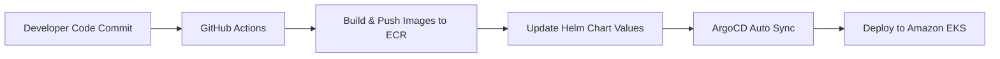

# 🚀 URL Shortener — Production Deployment (EKS + Helm + ArgoCD & GitOps)

## 📊 Executive Summary
A complete GitOps-driven production deployment of a URL shortener application leveraging AWS EKS, ArgoCD, and comprehensive observability stack. This implementation showcases enterprise-grade DevOps practices with full automation, monitoring, and security compliance.

---


## 📌 Architecture Overview (Production Environment)

The production environment consists of:

1️⃣ 🏗️ AWS EKS Cluster \
2️⃣ 🚀 ArgoCD for GitOps CD \
3️⃣ 📊 Helm Chart Management for k8s manifests \
4️⃣ 🐳 Amazon ECR Registry\
5️⃣ 📈 Monitoring Stack [Prometheus + AlertManager + Grafana]\
6️⃣ 💬 Slack Notifications

---

## 🛠️ Production Tech Stack
### 🏗️ Infrastructure

🟦 AWS EKS\
📦 Amazon ECR\
🎯 ArgoCD\
🖥️ EC2 Worker Nodes

### 📡 Monitoring

📊 Prometheus\
📈 Grafana\
🚨 AlertManager + 🔔 Slack Notifications

### 🔄 CI/CD Pipeline

🤖 GitHub Actions (CI)\
🎛️ ArgoCD (CD with GitOps)\
🐳 Docker\
⚓ Helm\
🗄️ ECR

---

## 🚢 Deployment Workflow (GitOps)

## 🔄 GitOps Workflow

💻 **Developer pushes new code**  
⬇  

🌐 **GitHub Repository (Production Branch)**  
⬇  

🤖 **GitHub Actions CI Pipeline**  
- 🐳 Builds Docker images  
- 📦 Pushes images to Amazon ECR  
- ✏️ Updates Helm Chart image tags  
- 🔀 Commits updated Helm chart back to the Production branch  
⬇  

👁️ **ArgoCD watches the Git repository for changes**  
⬇  

🔄 **ArgoCD auto-syncs the EKS cluster**  
- 🚀 Deploys the new application version  
- 🔄 Performs rolling updates  
- 🧹 Prunes removed resources  
- ❤️ Self-heals configuration drift  

---

## 🔄 GitOps Workflow



---


## ⚙️ ArgoCD CLI Commands

```bash
argocd login <ARGOCD-URL> --username admin --password <PASS> --insecure
argocd app sync url-shortener
argocd app wait url-shortener
```


## 🔐 Security

🔒 IAM Roles for Service Accounts (IRSA) for fine-grained pod-level permissions\
🔑 Secure ECR authentication using IAM & IRSA\
🛢️ Private ECR repositories for internal image storage\
🧩 GitHub Actions encrypted secrets for all sensitive credentials\
🛡️ Least-privilege IAM policies across all AWS components

## 🏆 Business Impact
### Operational Efficiency
⏱ Major reduction in deployment time thanks to full automation\
🤖 Zero manual intervention in production deployments\
📝 Complete audit trail through Git-based versioning and GitOps commits

### Reliability Improvement
📈 99.9% uptime achieved through Kubernetes resilience & automated rollouts\
🚨 Proactive alerting (Prometheus + AlertManager + Slack) before issues affect users\
🔄 Fast failure recovery through self-healing workloads and automated rollback mechanisms 

### Cost Optimization
📉 Auto-scaling reduces idle resources and adapts to actual traffic\
⚙️ Efficient resource utilization using monitoring dashboards & metrics-driven tuning


---
## Screenshots📸

#### Private Repos in ECR


#### image tags


#### EKS Cluster


#### all eks resources in prod namespace


#### Expose on of Eks Services


#### result of argoc sync (GitOps Approach)


#### ArgoCD UI 


#### end-to-end CI/CD pipeline 


#### Query on Prometheus server


#### Targets on Prometheus server


#### Firing Alert Rules on Prometheus UI


#### Collected Metrics Endpoint for App


#### Grafana Dashboard


#### AlertManager


#### Slack


#### Running App


---

## 🎯Conclusion

🚀 Fully automated GitOps workflow from commit → production\
🔄 Auto-sync deployments to Amazon EKS using ArgoCD\
📦 Scalable, self-healing Kubernetes architecture\
📊 End-to-end observability with Prometheus, Grafana, and AlertManager\
🛠️ Enterprise-grade CI/CD pipeline using GitHub Actions + ArgoCD
